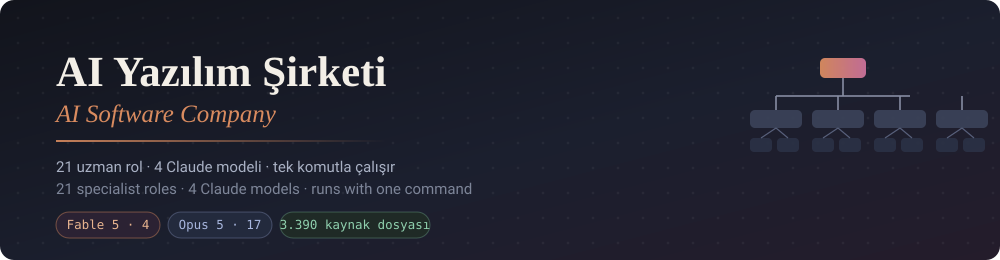
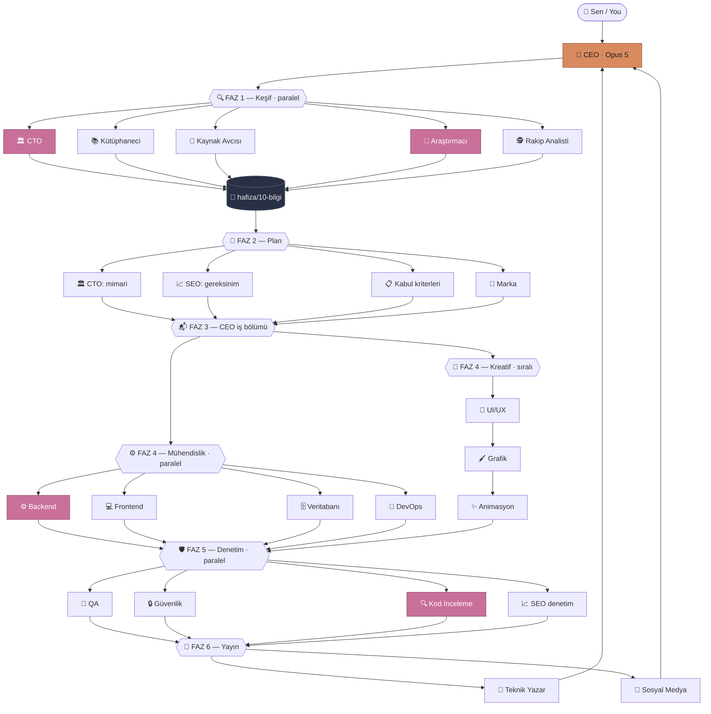

<div align="center">



# 🏢 Claude Code AI Yazılım Şirketi

### Tek komutla çalışan, 21 uzman rolden oluşan çok ajanlı yazılım ekibi
### *A 21-role multi-agent software team for Claude Code — one command to run*

[](https://claude.com/download)
[](#-kadro--the-team)
[](#-model-dağılımı)
[](LICENSE)

[](#-windows)
[](#-macos)
[](#-linux)

**🇹🇷 [Türkçe](#-türkçe) · 🇬🇧 [English](#-english)**

</div>

---

<div align="center">

### 📊 Paketle gelen kaynaklar

| 📚 Skills | 🔌 MCP | 📏 Rules | 🧩 Plugins | 🆓 Servis |
|:---:|:---:|:---:|:---:|:---:|
| **1.516** | **789** | **187** | **32** | **1.276** |

*Toplam 3.390 dosya · 26 MB · her biri ajanların erişimine açık*

</div>

---

## 📑 İçindekiler

<table>
<tr><td valign="top">

**🇹🇷 Türkçe**
- [Bu nedir?](#-bu-nedir)
- [Neden bir "şirket"?](#-neden-bir-şirket)
- [Kurulum](#-kurulum)
  - [Windows](#-windows)
  - [macOS](#-macos)
  - [Linux](#-linux)
- [İlk çalıştırma](#-ilk-çalıştırma)
- [Kadro](#-kadro--the-team)
- [Model dağılımı](#-model-dağılımı)
- [Nasıl çalışır?](#-nasıl-çalışır)
- [Zorunlu kaynak kuralı](#-zorunlu-kaynak-kuralı)
- [Arşiv](#-arşiv)
- [Hafıza](#-hafıza)
- [Özelleştirme](#-özelleştirme)
- [Sorun giderme](#-sorun-giderme)
- [SSS](#-sss)

</td><td valign="top">

**🇬🇧 English**
- [What is this?](#-what-is-this)
- [Why a "company"?](#-why-a-company)
- [Installation](#-installation)
  - [Windows](#-windows-1)
  - [macOS](#-macos-1)
  - [Linux](#-linux-1)
- [First run](#-first-run)
- [Model allocation](#-model-allocation)
- [How it works](#-how-it-works)
- [Mandatory-resource rule](#-mandatory-resource-rule)
- [Troubleshooting](#-troubleshooting)
- [FAQ](#-faq)

</td></tr>
</table>

---

# 🇹🇷 Türkçe

## 🤔 Bu nedir?

Claude Code'a **tek bir görev** veriyorsun. Arkada 21 uzman rol devreye giriyor:

> 🏛️ CTO mimariyi kuruyor → 🔬 araştırmacı GitHub'ı tarıyor → 📚 kütüphaneci 2.500+ hazır skill arasından işe yarayanları buluyor → ⚙️💻 geliştiriciler kodu yazıyor → 🔒🧪 güvenlik ve QA denetliyor → 📖 teknik yazar dokümante ediyor

Sen sadece 👔 **CEO** ile konuşuyorsun. Gerisini o yönetiyor.

```
Sen:  "Kullanıcıların not tutup etiketleyebildiği bir web uygulaması istiyorum."

CEO:  Bu büyük bir iş. Faz 1'i başlatıyorum — 5 ajan paralel...
      ✓ CTO projeyi okudu
      ✓ Kütüphaneci 12 skill, 3 rule, 2 MCP önerdi
      ✓ Kaynak Avcısı 4 ücretsiz servis buldu (Neon, Vercel, Resend, Upstash)
      ✓ Araştırmacı 8 kaynak topladı
      ✓ Rakip Analisti 5 rakip çıkardı
      → Faz 2: CTO mimariyi kuruyor...
```

## 💡 Neden bir "şirket"?

| | 🤖 Tek ajan | 🏢 Bu şirket |
|---|---|---|
| **Bilgi kaynağı** | Modelin hafızası | + 1.516 skill · 187 kural · 789 MCP · 1.276 ücretsiz servis · canlı araştırma |
| **Uzmanlık** | Genel amaçlı | Rol başına ayrı sistem promptu, araç seti ve model |
| **Denetim** | Yok — kendi işini kendi onaylar | Ayrı 🧪 QA, 🔒 güvenlik ve 🔍 kod inceleme rolleri |
| **Hafıza** | Oturumla sınırlı | Diskte kalıcı — `hafiza/` |
| **Model** | Tek model, her iş | Role göre Opus 5 veya Fable 5 |
| **Paralellik** | Sıralı | Bağımsız roller aynı anda |

---

## 📦 Kurulum

### ✅ Ön gereksinimler

| Gereksinim | Zorunlu mu? | Not |
|---|---|---|
| [Claude Code](https://claude.com/download) | ✅ Evet | Tüm platformlar |
| [Node.js](https://nodejs.org) 18+ | ⚠️ Sadece arşivi indireceksen | ZIP sürümünde arşiv hazır gelir |
| [Git](https://git-scm.com) | ❌ Hayır | Repo olarak klonlayacaksan |

---

### 🪟 Windows

<details open>
<summary><b>Adım adım kurulum</b></summary>

**1️⃣ Paketi al**

```powershell
# Seçenek A — ZIP (arşiv dahil, ~9 MB)
# sirket.zip dosyasını indir, sağ tık > "Tümünü Ayıkla"

# Seçenek B — Git ile klonla (arşiv ayrı indirilir)
git clone https://github.com/qaptanjes/claude-code-ai-company.git
cd claude-code-ai-company
```

**2️⃣ Kurulum scriptini çalıştır**

```powershell
.\kur.ps1
```

> ⚠️ **"Bu sistemde betik çalıştırma devre dışı" hatası alırsan:**
> ```powershell
> Set-ExecutionPolicy -Scope Process -ExecutionPolicy Bypass
> .\kur.ps1
> ```
> Bu sadece o pencere için geçerli, sistem ayarını kalıcı değiştirmez.

**3️⃣ Arşivi indir** (sadece git ile klonladıysan)

```powershell
.\arsiv-indir.ps1     # ~26 MB, 3-5 dakika
```

**4️⃣ Başlat**

```powershell
claude
```

</details>

<details>
<summary><b>🪟 Windows'a özel notlar</b></summary>

- **PowerShell sürümü:** Windows PowerShell 5.1 yeterli. PowerShell 7+ de çalışır.
- **Terminal:** Windows Terminal, PowerShell veya VS Code entegre terminali — hepsi olur.
- **Yol uzunluğu:** Arşivde derin klasör yapısı var. Paketi `C:\Users\<ad>\Desktop\` gibi kısa bir yola aç; çok derin bir yolda 260 karakter sınırına takılabilirsin.
- **VS Code kullanıyorsan:** PATH değişikliği sonrası VS Code'u **tamamen kapat** (sadece pencereyi değil). VS Code açılışta ortamı donduruyor; alt terminaller eski PATH'i miras alıyor.

</details>

---

### 🍎 macOS

<details open>
<summary><b>Adım adım kurulum</b></summary>

**1️⃣ Paketi al**

```bash
# Seçenek A — ZIP
unzip sirket.zip && cd sirket

# Seçenek B — Git
git clone https://github.com/qaptanjes/claude-code-ai-company.git
cd claude-code-ai-company
```

**2️⃣ Scripti çalıştırılabilir yap ve çalıştır**

```bash
chmod +x kur.sh
./kur.sh
```

**3️⃣ Arşivi indir** (sadece git ile klonladıysan)

```bash
node tools/indir.js arsiv
```

**4️⃣ Başlat**

```bash
claude
```

</details>

<details>
<summary><b>🍎 macOS'a özel notlar</b></summary>

- **Gatekeeper:** İndirilen ZIP'ten çıkan scriptler karantinaya alınabilir:
  ```bash
  xattr -d com.apple.quarantine kur.sh 2>/dev/null || true
  ```
- **Node.js kurulumu:** `brew install node` — Homebrew yoksa [nodejs.org](https://nodejs.org)'dan indir.
- **Apple Silicon (M1/M2/M3/M4):** Ek adım yok, native çalışır.
- **Kabuk:** Script `bash` ile yazıldı. Varsayılan kabuğun `zsh` olması sorun değil — `./kur.sh` shebang'i kullanır.

</details>

---

### 🐧 Linux

<details open>
<summary><b>Adım adım kurulum</b></summary>

```bash
# 1. Paketi al
git clone https://github.com/qaptanjes/claude-code-ai-company.git
cd claude-code-ai-company
# veya:  unzip sirket.zip && cd sirket

# 2. Kur
chmod +x kur.sh
./kur.sh

# 3. Arşivi indir (git ile klonladıysan)
node tools/indir.js arsiv

# 4. Başlat
claude
```

</details>

<details>
<summary><b>🐧 Dağıtıma özel notlar</b></summary>

**Node.js kurulumu:**

```bash
# Debian / Ubuntu
curl -fsSL https://deb.nodesource.com/setup_20.x | sudo -E bash - && sudo apt install -y nodejs

# Fedora / RHEL
sudo dnf install nodejs

# Arch
sudo pacman -S nodejs npm

# Dağıtımdan bağımsız (nvm — sudo gerekmez)
curl -o- https://raw.githubusercontent.com/nvm-sh/nvm/v0.40.1/install.sh | bash
nvm install 20
```

- **WSL2:** Sorunsuz çalışır. Paketi Windows yolunda değil (`/mnt/c/...`), Linux dosya sisteminde (`~/`) tut — dosya erişimi kat kat hızlı.
- **Headless sunucu:** GUI gerekmiyor, tamamen terminal tabanlı.

</details>

---

## 🚀 İlk çalıştırma

Claude Code açıldıktan sonra CEO'ya doğrudan görevini söyle:

```
Kullanıcıların not tutup etiketleyebildiği bir web uygulaması istiyorum.
Ücretsiz servislerle çalışsın, mobilde de düzgün görünsün.
```

### 💬 Örnek görevler

| Görev | Ne olur |
|---|---|
| `Bu repoyu güvenlik açısından denetle` | 🔒 Güvenlik + 🔍 Kod inceleme rolleri çalışır |
| `Landing page tasarla, 4 marka yönü öner` | 🎨 Kreatif Direktör → 🧭 UI/UX → 🖌️ Grafik → ✨ Animasyon |
| `Şu API'yi belgele ve README yaz` | 📖 Teknik Yazar |
| `Rakiplerimizi analiz et` | 🕵️ Rakip Analisti + 🔬 Araştırmacı |
| `Şu fonksiyondaki bug'ı bul` | Kısa devre — doğrudan 🔍 Kod Gözden Geçirici |

CEO işi **küçük / orta / büyük** diye sınıflandırır ve sadece gereken rolleri çalıştırır.
Küçük iş için 21 rol çalıştırmaz.

---

## 👥 Kadro — The Team

Her rol `.claude/agents/` altında ayrı bir dosya — açıp okuyabilir, değiştirebilirsin.

| # | 🎭 Rol / Role | 🤖 Model | 📍 Faz | İşi / Job |
|---|---|---|---|---|
| 1 | 👔 **CEO** | Opus 5 | — | Görev alır, iş böler, rapor eder |
| 2 | 🏛️ **CTO** | 🔥 Fable 5 | 2 | Mimari ve iş planı |
| 3 | 🎨 Kreatif Direktör | Opus 5 | 2 | Marka konumlandırma, görsel dil |
| 4 | 📋 Ürün Analisti | Opus 5 | 2 | Kabul kriterleri |
| 5 | 📚 Skill Kütüphanecisi | Opus 5 | 1 | Arşivden doğru kaynağı bulur |
| 6 | 🎯 Kaynak Avcısı | Opus 5 | 1 | Ücretsiz servisler + limitleri |
| 7 | 🔬 **Teknik Araştırmacı** | 🔥 Fable 5 | 1 | GitHub · GitLab · web |
| 8 | 🕵️ Rakip Analisti | Opus 5 | 1 | Pazar ve konumlandırma |
| 9 | ⚙️ **Backend / Sistem Mimarı** | 🔥 Fable 5 | 4 | Sunucu, API, iş mantığı |
| 10 | 💻 Frontend | Opus 5 | 4 | Arayüz kodu |
| 11 | 🗄️ Veritabanı | Opus 5 | 4 | Şema, migration, indeks |
| 12 | 🚀 DevOps | Opus 5 | 4 | Build, CI/CD, dağıtım |
| 13 | 🧭 UI/UX | Opus 5 | 4 | Akış, düzen, durumlar |
| 14 | 🖌️ Grafik Tasarımcı | Opus 5 | 4 | Renk, tipografi, SVG |
| 15 | ✨ Animasyoncu | Opus 5 | 4 | Geçişler, mikro-etkileşim |
| 16 | 🧪 QA / Test | Opus 5 | 5 | Kenar durumlar, gerçek hata |
| 17 | 🔒 Güvenlik | Opus 5 | 5 | Açık taraması, sır sızıntısı |
| 18 | 🔍 **Kod Gözden Geçirici** | 🔥 Fable 5 | 5 | Son savunma hattı |
| 19 | 📈 SEO | Opus 5 | 2+5 | Mimari girdisi + denetim |
| 20 | 📖 Teknik Yazar | Opus 5 | 6 | README, API, kurulum |
| 21 | 📣 Sosyal Medya | Opus 5 | 6 | Lansman içeriği |

> 🔥 = Fable 5 · geri kalanı Opus 5

---

## 🤖 Model dağılımı

Atama **yetenek–süre** dengesine göre yapıldı, fiyata göre değil:

```
🔥 Fable 5  ████                      4 rol   en zor muhakeme, uzun tur kabul edilebilir
🧠 Opus 5   █████████████████        17 rol   geri kalan her şey
```

**Neden her şey Fable 5 değil?** Fable 5 zor işlerde tek istekte dakikalarca çalışabiliyor.
👔 CEO'yu Fable 5 yapsak her mesajın dakikalarca beklerdi — şirket kullanılmaz olurdu.

### ⚠️ İki atama bilinçli olarak "en üst model" değil

| Rol | Model | Neden |
|---|---|---|
| 🔒 **Güvenlik** | Opus 5 | Fable 5'in güvenlik sınıflandırıcıları siber içeriği hedef alıyor; model bu alan için tasarlanmadı. Meşru güvenlik denetimi bile reddedilebilir. |
| 🔍 **Kod Gözden Geçirici** | Fable 5 ama **güvenlik analizi yapmaz** | Fable 5'in bug bulma üstünlüğü güvenlik odaklı analizi kapsamıyor. O iş 17 numaraya ait. |

---

## ⚙️ Nasıl çalışır?



**🩷 Pembe** kutular Fable 5 · **🧡 Turuncu** CEO · geri kalanı Opus 5

### 🔀 Faz özeti

| Faz | Ne olur | Paralel mi? |
|---|---|---|
| 1️⃣ **Keşif** | CTO · Kütüphaneci · Kaynak Avcısı · Araştırmacı · Rakip Analisti | ✅ 5 ajan aynı anda |
| 2️⃣ **Plan** | CTO mimari · SEO gereksinim · Kabul kriterleri · Marka | ⚡ CTO önce, sonra 3'ü paralel |
| 3️⃣ **İş bölümü** | CEO her role brief yazar | — |
| 4️⃣ **Yapım** | Mühendislik 4 rol · Kreatif 3 rol | ✅ mühendislik / ⛓️ kreatif sıralı |
| 5️⃣ **Denetim** | QA · Güvenlik · Kod İnceleme · SEO | ✅ 4 ajan aynı anda |
| 6️⃣ **Yayın** | Teknik Yazar · Sosyal Medya | ✅ |

---

## 📜 Zorunlu kaynak kuralı

Bu şirketin ayırt edici kuralı: **hiçbir rol çıplak görev almaz.**

CEO'nun yazdığı her brief kullanılacak kaynakları isimle listeler, rol işi bitirince
nerede kullandığını tabloyla kanıtlar:

```markdown
## ZORUNLU KAYNAKLAR

### 📏 Rules — uyulacak, sapma gerekçe ister
- arsiv/rules/cursor-react/.cursorrules
  Neden: proje React 19; hook ve state kuralları bağlayıcı

### 📚 Skills — okunacak ve uygulanacak
- arsiv/skills/testing-best-practices/SKILL.md

### 🔌 MCP — kurulacak ve kullanılacak
- arsiv/mcp/github/INSTALL.md

### 🆓 Servisler
- Neon Postgres — ücretsiz limit: 0.5 GB depolama, 190 saat/ay compute

## ✅ GERİ BİLDİRİM — doldurmadan teslim etme
| Kaynak | Nerede kullandım | Kullanmadıysam neden |
|---|---|---|
```

**Boş bırakılan satır işi geri döndürür.** 🔍 Kod Gözden Geçirici bu tabloyu denetler.

### 🔀 Çakışma önceliği

```
1. 👤 Kullanıcının talimatı
2. 🏛️ hafiza/20-plan/mimari.md  (CTO)
3. 🔒 Güvenlik bulguları
4. 📏 arsiv/rules/
5. 📚 arsiv/skills/
6. 🤖 Modelin varsayılanı
```

Bir rol çakışma görürse kendi kararını vermez — CEO'ya bildirir, karar
`hafiza/00-brief/kararlar.md`'ye yazılır ve bağlayıcı olur.

---

## 📚 Arşiv

```
arsiv/
├── 📚 skills/    1.516 kayıt  ← mdskills.ai
├── 🔌 mcp/         789 kayıt  ← her birinde INSTALL.md
├── 📏 rules/       187 kayıt  ← .cursorrules · .mdc
├── 🧩 plugins/      32 kayıt
└── 🆓 dev/       1.276 servis ← free-for.dev
```

Her klasörde `_catalog.json` (tam metadata) ve `_index.md` (özet) var.

> ⚠️ **Arşiv üçüncü taraf içerik.** Kayıtların çoğu `shell exec`, `filesystem write` ve
> `network access` izni beyan ediyor. 📚 Kütüphaneci rolü bunu raporlar, ama bir skill'i
> kullanmadan önce okumak senin sorumluluğun.

> 💡 **Kalite değişken:** Kayıtların bir kısmı gerçek skill değil, GitHub README'si.
> `_catalog.json` → `format_standard: "skill_md"` olanlar gerçek skill; `generic`
> olanlar sadece dokümantasyon. Kütüphaneci bu ayrımı yapıyor.

---

## 💾 Hafıza

Subagent'ların **kalıcı hafızası yok** — kapanınca context kaybolur. Kurumsal hafıza diskte yaşar:

```
hafiza/
├── 00-brief/      📥 görev · alınan kararlar
├── 10-bilgi/      🧠 skills · kaynaklar · araştırma · rakipler
├── 20-plan/       📐 mimari · iş planı · kabul kriterleri · marka · seo
├── 30-gorevler/   📬 rol başına brief
└── 40-urun/       📦 kod · marka varlıkları · içerik · raporlar
```

---

## 🛠️ Özelleştirme

<details>
<summary><b>Bir rolün modelini değiştirmek</b></summary>

`.claude/agents/<rol>.md` dosyasının başındaki `model:` satırını düzenle:

```yaml
---
name: backend
model: opus     # fable | opus | sonnet | haiku
---
```

</details>

<details>
<summary><b>Yeni rol eklemek</b></summary>

`.claude/agents/` altına yeni bir `.md` dosyası aç:

```markdown
---
name: mobil-gelistirici
description: iOS ve Android native geliştirme. Faz 4.
tools: Read, Write, Edit, Bash, Glob, Grep
model: opus
---

Mobil geliştiricisin. Brief'in hafiza/30-gorevler/mobil-gelistirici.md.
...
```

Sonra `CLAUDE.md`'deki kadro tablosuna ekle ki CEO rolü tanısın.

</details>

<details>
<summary><b>Bir rolü devre dışı bırakmak</b></summary>

Dosyayı sil veya uzantısını değiştir (`cto.md` → `cto.md.disabled`).
`CLAUDE.md`'deki tablodan da çıkar.

</details>

<details>
<summary><b>Arşivi güncellemek</b></summary>

```bash
node tools/indir.js arsiv
```
Var olan dosyaların üzerine yazar. mdskills.ai ve free-for.dev sürekli güncelleniyor.

</details>

---

## 🔧 Sorun giderme

<details>
<summary><b>❌ "claude" komutu bulunamıyor</b></summary>

Claude Code kurulu ama PATH'te değil.

**🪟 Windows:**
```powershell
$u = [Environment]::GetEnvironmentVariable("Path","User")
[Environment]::SetEnvironmentVariable("Path", $u.TrimEnd(';') + ";$env:USERPROFILE\.local\bin", "User")
```

**🍎🐧 macOS / Linux:**
```bash
echo 'export PATH="$HOME/.local/bin:$PATH"' >> ~/.zshrc   # veya ~/.bashrc
source ~/.zshrc
```

> 🔁 **Terminali kapatıp yeniden aç.** Çalışan süreçlere PATH değişikliği geçmişe dönük
> uygulanmaz. VS Code kullanıyorsan **VS Code'u tamamen kapat**, sadece pencereyi değil —
> VS Code ortamı açılışta donduruyor ve tüm alt terminaller onu miras alıyor.

</details>

<details>
<summary><b>❌ Fable 5 rolleri 400 hatası veriyor</b></summary>

Fable 5 **30 günlük veri saklama** gerektirir. Hesabın sıfır-veri-saklama (ZDR)
ayarındaysa her istek `400 invalid_request_error` döner — istek kusursuz olsa bile.

**Çözüm — 4 rolü Opus 5'e al:**

🪟 Windows:
```powershell
Get-ChildItem .claude\agents\*.md | ForEach-Object {
  (Get-Content $_ -Raw) -replace 'model: fable','model: opus' | Set-Content $_ -Encoding utf8
}
```

🍎🐧 macOS / Linux:
```bash
sed -i.bak 's/^model: fable$/model: opus/' .claude/agents/*.md
```

Etkilenen roller: `cto` · `arastirmaci` · `backend` · `kod-gozden-gecirici`

</details>

<details>
<summary><b>❌ Ajanlar arşivi bulamıyor</b></summary>

Claude Code'u **paket kökünden** başlatmalısın — `arsiv/` ve `hafiza/` yolları göreli.

```bash
cd claude-code-ai-company   # kur.ps1 / kur.sh'ın olduğu klasör
claude
```

Alt klasörden başlatırsan ajanlar arşivi göremez.

</details>

<details>
<summary><b>❌ Ajan katalog okurken takılıyor / context doluyor</b></summary>

`arsiv/skills/_catalog.json` yüz binlerce token. Ajanlar önce `Grep` ile daraltmak üzere
talimatlandırıldı, ama biri yine de bütünü açmaya kalkarsa durdur ve şunu söyle:

> *"Katalogu Read ile açma, önce Grep ile daralt."*

</details>

<details>
<summary><b>🐌 Çok yavaş çalışıyor</b></summary>

İki sebep olabilir:

1. **Fable 5 turları uzun.** Zor işlerde tek istek dakikalarca sürebilir — 🏛️ CTO ve
   ⚙️ Backend için beklenen davranış, hata değil.
2. **Ajanlar sırayla çalışıyor.** CEO'nun paralel başlatması gerekir:
   > *"Bu fazın ajanlarını tek mesajda paralel başlat."*

Eşzamanlı ajan sayısı makinenin çekirdek sayısıyla sınırlı — 5 ajanlık faz sıraya girebilir.

</details>

<details>
<summary><b>🐘 Her küçük iş için 21 rol çalışıyor</b></summary>

CEO işi yanlış sınıflandırmış:

> *"Bu küçük bir iş, kısa devre yap."*

Sınıflandırma tablosu `CLAUDE.md` içinde.

</details>

<details>
<summary><b>❌ kur.ps1 çalışmıyor — "betik çalıştırma devre dışı"</b></summary>

```powershell
Set-ExecutionPolicy -Scope Process -ExecutionPolicy Bypass
.\kur.ps1
```

`-Scope Process` sadece o pencere için geçerli; sistem ayarını değiştirmez.

</details>

<details>
<summary><b>❌ kur.sh "Permission denied"</b></summary>

```bash
chmod +x kur.sh && ./kur.sh
```

</details>

<details>
<summary><b>❌ arsiv-indir.ps1 / indir.js çalışmıyor</b></summary>

Node.js 18+ gerekli.

🪟 Node kurulu ama bulunamıyorsa:
```powershell
$env:Path += ";C:\Program Files\nodejs"
.\arsiv-indir.ps1
```

İndirme mdskills.ai API'sine ~3.600 istek atıyor, 3-5 dakika sürer. Kesilirse baştan
çalıştır — var olan dosyaların üzerine yazar.

</details>

<details>
<summary><b>❌ ZIP açıldığında klasör yapısı bozuk (macOS/Linux)</b></summary>

Bu paketin ZIP'i POSIX düz bölü (`/`) ile üretildi, sorun çıkmamalı. Başka bir kaynaktan
aldığın ZIP'te `sirket\README.md` gibi tek parça dosya adları görüyorsan, Windows'ta
yanlış araçla sıkıştırılmış demektir:

```bash
# 7-Zip ile aç
7z x sirket.zip
```

</details>

---

## ❓ SSS

<details>
<summary><b>Bu bir Claude Code eklentisi mi?</b></summary>

Hayır. Claude Code'un yerleşik <b>subagent</b> özelliğini kullanan bir yapılandırma paketi.
Kurulum gerektiren bir eklenti yok — `.claude/agents/` klasörü ve `CLAUDE.md` yeterli.

</details>

<details>
<summary><b>API anahtarı gerekiyor mu?</b></summary>

Hayır, Claude Code kendi oturumunu kullanıyor. Ayrı anahtar girmiyorsun.

</details>

<details>
<summary><b>Kendi projemde kullanabilir miyim?</b></summary>

Evet. `.claude/`, `CLAUDE.md`, `arsiv/` ve `hafiza/` klasörlerini projenin köküne
kopyala. Ajanlar göreli yol kullanıyor, çalışır.

</details>

<details>
<summary><b>21 rolün hepsi her seferinde çalışıyor mu?</b></summary>

Hayır. CEO işi küçük/orta/büyük diye sınıflandırıyor ve kısa devre yapıyor. Tek dosyalık
bir düzeltme için 2-3 rol yeterli.

</details>

<details>
<summary><b>Arşivi kendim güncelleyebilir miyim?</b></summary>

Evet: `node tools/indir.js arsiv` — kaynağından yeniden çeker.

</details>

<details>
<summary><b>Türkçe dışında çalışır mı?</b></summary>

Evet. Ajan talimatları Türkçe ama modeller çok dilli — İngilizce görev verirsen İngilizce
çalışırlar. Talimatları çevirmek istersen `.claude/agents/*.md` dosyalarını düzenle.

</details>

---
---

# 🇬🇧 English

## 🤔 What is this?

You give Claude Code **a single task**. Behind it, 21 specialist roles go to work:

> 🏛️ the CTO designs the architecture → 🔬 the researcher scans GitHub → 📚 the librarian
> finds what's useful among 2,500+ ready-made skills → ⚙️💻 developers write the code →
> 🔒🧪 security and QA review it → 📖 the technical writer documents it

You only talk to the 👔 **CEO**. It runs everything else.

## 💡 Why a "company"?

| | 🤖 Single agent | 🏢 This company |
|---|---|---|
| **Knowledge** | Model's memory | + 1,516 skills · 187 rules · 789 MCPs · 1,276 free services · live research |
| **Expertise** | General-purpose | Separate system prompt, tool set and model per role |
| **Review** | None — approves its own work | Dedicated 🧪 QA, 🔒 security and 🔍 code-review roles |
| **Memory** | Session-bound | Persisted on disk — `hafiza/` |
| **Model** | One model for everything | Opus 5 or Fable 5, per role |
| **Parallelism** | Sequential | Independent roles run simultaneously |

---

## 📦 Installation

### ✅ Prerequisites

| Requirement | Required? | Note |
|---|---|---|
| [Claude Code](https://claude.com/download) | ✅ Yes | All platforms |
| [Node.js](https://nodejs.org) 18+ | ⚠️ Only to fetch the archive | ZIP release ships it |
| [Git](https://git-scm.com) | ❌ No | Only if cloning |

### 🪟 Windows

```powershell
git clone https://github.com/qaptanjes/claude-code-ai-company.git
cd claude-code-ai-company
.\kur.ps1
.\arsiv-indir.ps1     # ~26 MB, 3-5 min
claude
```

> If you get *"running scripts is disabled"*:
> `Set-ExecutionPolicy -Scope Process -ExecutionPolicy Bypass`

Keep the package on a **short path** (e.g. Desktop) — the archive has deep nesting and
Windows has a 260-character path limit.

### 🍎 macOS

```bash
git clone https://github.com/qaptanjes/claude-code-ai-company.git
cd claude-code-ai-company
chmod +x kur.sh && ./kur.sh
node tools/indir.js arsiv
claude
```

If Gatekeeper quarantines the script: `xattr -d com.apple.quarantine kur.sh`
Apple Silicon works natively, no extra steps.

### 🐧 Linux

```bash
git clone https://github.com/qaptanjes/claude-code-ai-company.git
cd claude-code-ai-company
chmod +x kur.sh && ./kur.sh
node tools/indir.js arsiv
claude
```

**Node.js:** `sudo apt install nodejs` (Debian/Ubuntu) · `sudo dnf install nodejs`
(Fedora) · `sudo pacman -S nodejs` (Arch) · or [nvm](https://github.com/nvm-sh/nvm).

**WSL2:** works fine — keep the package on the Linux filesystem (`~/`), not `/mnt/c/`,
for much faster file access.

---

## 🚀 First run

```
I want a web app where users can take notes and tag them.
Use free services, and make it work well on mobile.
```

The CEO classifies the job as small / medium / large and runs only the roles it needs.

---

## 🤖 Model allocation

Roles are assigned on a **capability-vs-latency** basis, not on price:

- 🔥 **Fable 5** — the 4 roles where reasoning is hardest and a multi-minute turn is
  acceptable: CTO, Researcher, Backend, Code Reviewer.
- 🧠 **Opus 5** — the other 17, including the CEO (it's the conversational surface;
  Fable 5's long turns would make every reply feel broken).

### ⚠️ Two assignments are deliberately *not* the top-tier model

| Role | Model | Why |
|---|---|---|
| 🔒 **Security** | Opus 5 | Fable 5's safety classifiers target cybersecurity content and the model isn't intended for that domain — a security agent on it would hit refusals doing legitimate work. |
| 🔍 **Code Reviewer** | Fable 5, but **no security analysis** | Fable 5's bug-finding advantage explicitly excludes security-focused analysis. That work belongs to role 17. |

---

## ⚙️ How it works

See the [flow diagram above](#-nasıl-çalışır) — the same pipeline applies.

| Phase | What happens | Parallel? |
|---|---|---|
| 1️⃣ **Discovery** | CTO · Librarian · Resource Scout · Researcher · Competitor Analyst | ✅ 5 at once |
| 2️⃣ **Plan** | CTO architecture · SEO requirements · Acceptance criteria · Brand | ⚡ CTO first, then 3 in parallel |
| 3️⃣ **Assignment** | CEO writes a brief per role | — |
| 4️⃣ **Build** | Engineering ×4 · Creative ×3 | ✅ engineering / ⛓️ creative sequential |
| 5️⃣ **Review** | QA · Security · Code Review · SEO | ✅ 4 at once |
| 6️⃣ **Ship** | Tech Writer · Social Media | ✅ |

---

## 📜 Mandatory-resource rule

The defining rule: **no role receives a bare task.** Every brief the CEO writes names the
resources to use, and the role proves where it used them in a table before delivering.
An empty row sends the work back. The 🔍 Code Reviewer audits that table.

**Conflict precedence:** user instruction → CTO architecture → security findings →
`arsiv/rules/` → `arsiv/skills/` → model default.

---

## 📚 The archive

3,390 files, 26 MB under `arsiv/` — 1,516 skills, 789 MCP servers, 187 rulesets and 32
plugins from [mdskills.ai](https://www.mdskills.ai), plus 1,276 free developer services
from [free-for.dev](https://free-for.dev).

> ⚠️ **Third-party content.** Most entries declare `shell exec`, `filesystem write` and
> `network access` permissions. The librarian role reports this, but reading a skill
> before using it is on you.

---

## 🔧 Troubleshooting

| ❌ Symptom | ✅ Fix |
|---|---|
| `claude` not found | Add `~/.local/bin` (or `%USERPROFILE%\.local\bin`) to PATH, **restart the terminal** — and fully quit VS Code if you use it |
| Fable 5 roles return 400 | Account is on zero-data-retention. `sed -i 's/^model: fable$/model: opus/' .claude/agents/*.md` |
| Agents can't find the archive | Start Claude Code from the package **root** — paths are relative |
| Agent stalls reading a catalog | Tell it: *"Don't Read the catalog, Grep it first"* |
| Very slow | Fable 5 turns run long by design; also check the CEO is launching agents in parallel |
| 21 roles for a tiny task | Tell the CEO: *"This is small, short-circuit it"* |
| `kur.ps1` blocked | `Set-ExecutionPolicy -Scope Process -ExecutionPolicy Bypass` |
| `kur.sh` permission denied | `chmod +x kur.sh` |

---

## ❓ FAQ

**Is this a Claude Code plugin?** No — it's a configuration package using Claude Code's
built-in subagent feature. Just `.claude/agents/` and `CLAUDE.md`.

**Do I need an API key?** No. Claude Code uses your existing session.

**Can I use it in my own project?** Yes — copy `.claude/`, `CLAUDE.md`, `arsiv/` and
`hafiza/` into your project root. Agents use relative paths.

**Do all 21 roles run every time?** No. The CEO short-circuits small jobs.

**Does it work in English?** Yes. Agent instructions are in Turkish but the models are
multilingual — prompt in English and they respond in English.

---

<div align="center">

### 🤝 Katkı / Contributing

Issue ve PR'lar açık. Yeni rol, model ayarı önerisi veya çeviri katkısı memnuniyetle.
*Issues and PRs welcome — new roles, model tuning, translations.*

### 📄 Lisans / License

[MIT](LICENSE) · Arşiv içeriği hariç — bkz. [NOTICE.md](NOTICE.md)
*MIT, excluding archive content — see [NOTICE.md](NOTICE.md)*

---

**⭐ Faydalı bulduysan yıldız bırak / Star it if you find it useful**

Built with [Claude Code](https://claude.com/claude-code) 🤖

</div>
